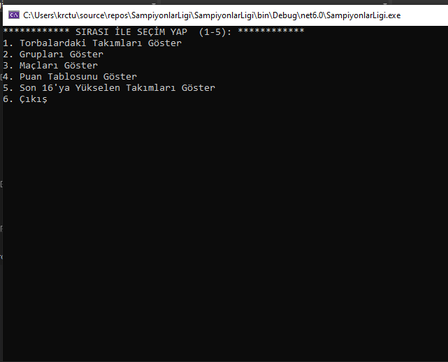
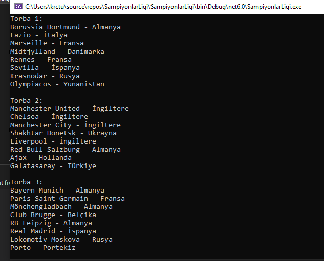
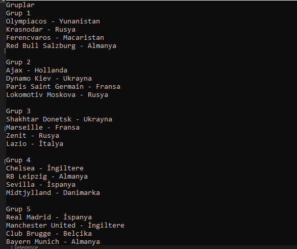
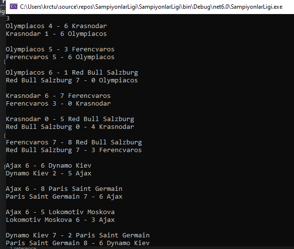
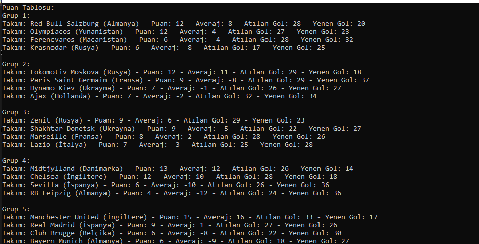
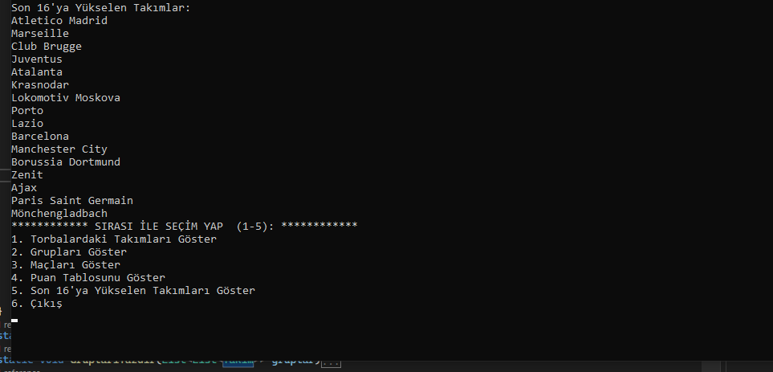

# SampiyonlarLigi Simülasyonu
## Proje Açıklaması 

- Konu : Şampiyonlar Ligi Simülasyonu

- Kuradaki takım sayısı 32 dir.

- Takımlar 4 torba içinde yer alacak ve 8 ayrı grup oluşturulacaktır

- Bir takım kendi torbasından ve ülkesinden bir takım ile eşleşemeyecektir. ( Takımlar ve torbalar ile ilgili bilgiler ektedir. )

- Her grupta toplam 4 takım olacaktır.

- Takımların kendi aralarında yapacağı maçlar için random fikstür oluşturulacaktır.

- İlk turda takımlar iç saha ve dış saha olmak üzere toplam 6 maç yapacaklardır.

- Takımların aralarında yapacağı maçlarda random sonuçlar olacaktır.

- Takımların kendi aralarında yapacağı maçlarda bir takım bir maçta 8'den fazla gol atamayacaktır.

- İlk tur maçlarında galip gelen takım 3 puan alacaktır. Beraberlik sonucu her 2 takım 1 puan kazanacaktır. Yenilen takım puan kazanamayacaktır.

- Gruplardaki ilk tur maçları tamamlandığı zaman grubunda 1. ve 2. sırada olan takımlar bir üst tura ( son 16 ) kalacaklardır.

- 1. ve 2. sıra belirleme kriterleri 

    - Önce puan sıralaması dikkate alınacaktır. 

   - Puanların eşit olması durumunda averaja bakılacaktır. ( Averaj hesaplaması = Toplam atılan gol - Toplam yenen gol )

   - Averajların da eşit olması durumunda takımların attığı toplam gol sayısı dikkate alınacaktır.

   - Gol sayıları da eşit durumda ise 1.lik için 2 takımdan herhangi biri random seçilebilir.

### Proje bir menü şeklinde çalışır. Menü sırası ile işlemleri gerçekleştirir. Aşağıda gösterilmiştir.

### 1 numaralı işlem Kurada ki 32 takımı 4 torbaya rastgele dağıtır.

### 2 numaralı işlem de Kura çekilir ve 8 ayrı grup oluşturulur.Her bir grup da 4 takım yer alır. Bu şekilde proje isteklerini karşılar

### 3 numaralı işlemde maçlar oynanır ve projeye uygun bir şekilde evde ve deplasman olmak üzere bir takım toplam 6 maç oynar.

### 4 numaralı işlemde Puan tablosu gösterilir

### 5 numaralı işlem de gruplarında 1. ve 2. olan takımlar bir üst tura(son 16) yükselir.

